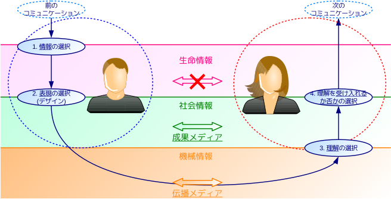

# システム論に基づく情報教育の授業計画と教育実践

現在、文科省の情報WGでは、新課程「情報I(仮称)」において育む資質・能力の検討が進められているが、短期適応的な問題解決を導入に位置づけるなど、学習内容が深まらない懸念がある。本稿では、情報Iの内容と対応させつつシステム論や組織論の知見を取り込み、長期適応的に学習すべき、体系的かつ実践的な授業計画を提案する。提案に基づき作成した教材の紹介に加え、計画の一部に基づき行った教育実践とその評価を示す。

はじめに
========

現在、文科省の情報WGでは、新課程における情報科の改善が議論されている。このうち新設の「情報I(仮称)」は「問題の発見・解決に向けて、事象を情報とその有機的な結び付きの視点から捉え、情報技術を適切かつ効果的に活用する力を育む科目」と位置づけられ[1]、科目で身に付けるべき資質・能力の検討が重ねられている。

現時点の単元案[1]では、「情報社会の問題解決」が筆頭に置かれ、他の単元の導入として位置づけられている。March and Simon[2]は、**問題解決**(problem solving)を「行動のレパートリーを変化させずに行う」適応行動であり、短期適応的な変容だと述べている。一方、**学習**(learning)は長期適応的な適応行動であり、「行動レパートリー自体を変化させて行う」ものだという。確かに問題解決は重要だが、科目の中軸に位置づけるにはやや浅く、情報Iが即物的な学習に留まる懸念がある。体験を通した発見的な学習は、一部の「勘の良い」生徒には有効だが、Bruner[3]は、すべての生徒が理解できる授業を展開するために、科目における要素間の**関係性**、即ち科目の**構造**(structure)を生徒に明示することの重要さを述べている。

そこで本稿では、システム論や組織論の知見に基づく、体系的な情報教育の授業計画を提案する。提案では、提案内容を情報Iの授業として実施できるよう、情報Iの単元案と対応させる。また、提案に基づき勤務校で行った実践を示す。

先行研究
========

Bertalanffy[4]は**システム**(system)を「相互に作用する要素の集合」と定義した。システムには、思考を要素とする**心理システム**や、コミュニケーションを要素とする**社会システム**がある。個人は心理システムの、組織は社会システムの具体例である[5][6]。

情報Iの授業計画
===============

情報WGの単元案[1]に基づく授業計画を示す。

情報社会の問題解決
------------------

現代の情報社会の問題を授業で扱うには、まず現代に対する認識の共有が必要である。Luhmannによれば、現代社会はシステムの**機能的分化**が進み、各システムが高度に専門化している[6]。情報技術や通信ネットワークの発展は、これを更に加速させている。その結果、システム間の**社会的包摂**(inclusion)が緩む一方で、**社会的排除**(exclusion)の領域で高度に統合されている[6]。「炎上」やヘイトスピーチ、イスラム国などに代表される他者への過激な排除行動の他、セーフティネットの欠如によるホームレスの再就労問題や貧困家庭の問題が、ここに起因する。

現代では情報機器やSNSの普及により、誰もが発信力と行動力を持つ。生徒には、能力と責任をもつ個人として、こうした問題に関心を持ち、解決へ向け主体的に参画することが求められる。

こうした高度な問題の解決には、これまで学んだ知識や方法を適用するだけでは不十分である。実践を交えつつ情報とコミュニケーションの視座から社会を科学的に理解し、社会の問題に取り組む科目として、情報Iを位置づける。

コミュニケーションと情報デザイン
--------------------------------

まず基本的な内容として、情報、コミュニケーション、メディアの概念を扱う授業には、社会学と基礎情報学に基づく筆者らの実践がある[7][8][9]。ここでは、生命の内部(in)に意味を形成させる(form)ものとして**情報**(information)を定義し、生命情報・社会情報・機械情報の3種を示す。**個人情報**は特定の個人を想起させる情報、**暗号**は、機械情報へ強制的に変化させた社会情報である。その上でLuhmannの**コミュニケーション**・モデルを修正した、(生命)情報の選択、表現の選択(**デザイン**)、理解の選択、理解の受容の選択からなるモデルを示す。コミュニケーションを媒介するものとして**メディア**(media)を定義し、伝播メディアと成果メディアの役割と特性を示す。以上をまとめて図1に示す。特に、コミュニケーションの送り手と受け手(図1での点線の円内)としての能力を**メディア・リテラシー**(media literacy)と総称する。

メディア・リテラシーの視点では、表現と理解の選択が重点となる。筆者ら[9]はLuhmann[6]から「(情報) + (**意図**) = (表現)」の関係を示し、左辺からの右辺の生成を**表現の選択**、右辺からの左辺の生成を**理解の選択**とする。表現の選択では、インタフェースやユニバーサルデザインと関連させた筆者らのデザイン教育の実践[10]がある。

これらに加え、より応用的な情報デザインについて、個人や組織といったシステムが新たな情報を創り出す**創発**(emergence)と、他者の行動変容を目的とするコミュニケーションである**介入**(interference)に関する講義と実習を行う。創発では個性、アイデア、特許要件、知的財産、著作権を、介入ではプレゼンテーションを題材とする。

コンピュータとプログラミング
----------------------------

**プログラム**(program)は「実行すべき命令の列」であり、プログラムを作成することを**プログラミング**(programming)という。「卒業式のプログラム」などの人間が実行するプログラムは、多少の曖昧な表現や誤った表現があっても、主観的に意味が理解される過程で補正されうる。一方プログラムを機械が解釈する場合、再現性ある正しい動作を保証する一方でその意味を理解しないため、各自の思考を明確化(情報の選択)した上で、厳密に文法に従った、曖昧性のない表現(表現の選択)が要求される。プログラミングを通して日々のコミュニケーションを省察し、情報社会に参画する上で、適切かつ効果的に自らの意見を伝える方法を学ぶ。

また**モデル化**(modeling)は、現実の事象の特定の部分に意味(関係性・構造)を見出し、それ以外の部分を捨象して**モデル**(model)を形成することである。主観的な意味を対象とする点で、モデル化はプログラミングより情報の深層に近く、創発とも関係がある。また、コンピュータによるシミュレーションの可否によらず、問題解決とも関係が深い。複数の現実世界の現象を比較して、因子の関係を**図解**・**図式化**していくことを通じて、現象の背景にあるモデルを見出す実習が必要である。

情報通信ネットワークとデータの活用
----------------------------------

情報の主観性には留意する必要があるが、コミュニケーションに関する筆者ら[9]の提案モデルは、代表的なネットワークモデルであるOSI参照モデルと類似する。OSIモデルのプロトコルと、言語そのものやLuhmannのメディアを対比できる。また、標準化や構造化はモデル化の一種である。

授業実践内容
============

提案した授業計画の実践として、勤務校での授業の整理・統合を進めている。特に創発に関する授業実践は、継続して改善を進めている。

実践結果と考察
==============

実践内容の生徒評価は不十分だが、システム論の構造に基づく整理・統合で授業が効率化されると共に、より深い内容を扱え、より多くの時間を実習に充当できる。以前は3.1、3.2節の内容に約30時間を要したが、今年度は内容を深めても約20時間で完了し、残りの約40時間を介入(プレゼンテーション)とプログラミングの実習に充当する。

参考文献
========

URLは2016/6/30時点のものである。

[1]: http://www.mext.go.jp/b_menu/shingi/chukyo/chukyo3/059/siryo/__icsFiles/afieldfile/2016/06/16/1371925_2.pdf "文科省中教審 初等中等教育分科会 教育課程部会 情報WG, 高等学校情報科（各学科に共通する教科）の改善について(第8回配付資料)"
[2]: http://amazon.jp/dp/4478021767 "James G. March, Herbert A. Simon, 『オーガニゼーションズ 第2版――現代組織論の原典』, ダイヤモンド社, 2014, ISBN: 4478021767"
[3]: http://amazon.jp/dp/4007301301 "J. S. Bruner, 『教育の過程』, 岩波書店, 1963"
[4]: http://amazon.jp/dp/4622025221 "Ludwig von Bertalanffy, 『一般システム理論――その基礎・発展・応用』, みすず書房, 1973, ISBN: 4622025221"
[5]: http://amazon.jp/dp/4478320020 "Chester I. Barnard, 『新訳 経営者の役割』, ダイヤモンド社, 1968, ISBN: 4478320020"
[6]: http://amazon.jp/dp/4478021767 "Christian Borch, 『ニクラス・ルーマン入門――社会システム理論とは何か』, 新泉社, 2014, ISBN: 4787714066"
[7]: http://jaeis.info/jaeis2016 "藤岡 健史, 大西 洋, 「情報一般の原理」を学ぶ情報教育カリキュラムの開発と評価－日本学術会議の参照基準に基づいた高校情報科の刷新に向けて－, JAEIS2016"
[8]: http://www.zenkojoken.jp/09kanagawa "藤岡 健史, 大西 洋, 下村 誠, 参照基準における「情報一般の原理」に関連する授業実践, 全高情研2016"
[9]: http://www.scribd.com/doc/299911454 "大西 洋, 藤岡 健史, コミュニケーション・情報・メディアの統合モデルに基づく教育実践, CIS2016"
[10]: http://www.scribd.com/doc/255147300 "大西 洋, 藤岡 健史, BADUIからユニバーサルデザインへ展開するデザイン教育実践, CIS2015"
