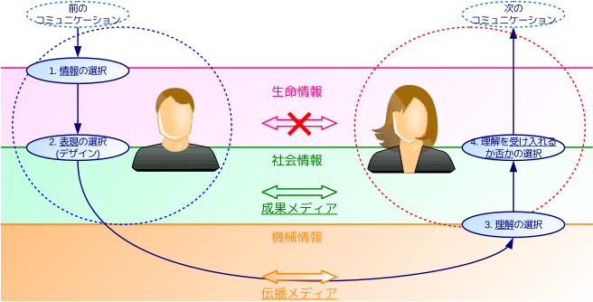

# 社会システム理論に基づく情報教育の教材開発

Developing Teaching Materials for Informatics based on Social Systems Theory

次期学習指導要領での教科「情報」の科目統合を視野に入れた、社会科学と自然科学を架橋する教育課程として、基礎情報学に基づく教育体系が提案されている。だが現状では、生徒の自習に適する資料や、概念理解を補助する事例の蓄積が不十分で、授業が教員の説明に依存する傾向にある。本稿では、情報学の概念理解を促し深めることを目的に、社会システム理論を背景に開発した教材を提案し、教材を用いた授業を紹介する。

キーワード：コミュニケーション　情報　システム　メディア　基礎情報学

はじめに
========

中教審答申[1]によれば、次期学習指導要領では、事象を「情報とその結び付きの視点」から捉える必修科目「情報I」が設けられる。また高校段階では特に、個々の知識や経験を「科学的な知として体系化」[2]することが求められる。この「科学」には、情報Iでの問題解決が「社会等」を対象とし、単元「コミュニケーションと情報デザイン」が設けられることから、計算機科学以外に、メディア学や社会学などの社会科学も含まれる。従って情報Iでは、「情報」概念を中核とした学際的で体系的な理解の涵養が求められる。

情報Iの実施を見据え、筆者ら[3] [4] [5] [6]は基礎情報学や社会システム理論に基づく教育課程を提案・試行している。また教授者向け書籍[7] [8]も刊行され、教育実践に必要な環境は整いつつある。しかし、初学者向け教材の蓄積はまだ不十分であり、学習者の理解を深化させる状況には至っていない。現状の授業は教授者の説明に時間を要し、「主体的・対話的で深い学び」[1]のための生徒の活動時間を十分に確保できていない。

そこで本稿では、初学者向けに開発中の自習用資料及び授業用教材について述べる。自習用資料では、情報・メディア・コミュニケーションの概念説明を中心に、計算機科学や社会学の周辺知識を紹介しながらも、システムや創発など発展的な内容も含めた。授業用教材では、既存の記事、画像、動画による体験的理解で概念理解の深化を図る。最後に、生徒の感想を紹介して実践の効果を示し、今後の課題を述べる。

先行研究
========

情報・コミュニケーション・メディア
----------------------------------

情報・コミュニケーション・メディアを統一的に理解するモデルとして、筆者[6]は社会学者Luhmannのモデル[9] [10]を修正した図1のモデルを提案した。

図1のモデルは、Luhmannのモデルを修正した上で、次に示す西垣[11]の情報概念と組み合わせている。

- **生命情報**: 「生命の内部(in)に意味を形成(form)させるもの」であり、最広義の情報(information)である。
- **社会情報**: 「記号・言語と意味が一体化した生命情報」であり、その意味を互いに理解することで、生命が社会活動を送ることが可能となる。
- **機械情報**: 「意味が潜在化した社会情報」であり、意味の潜在化により機械的な情報の複製や、計算機による高速な処理が可能となる。

コミュニケーションについては、多者間でなされる選択からなる過程であるとしたLuhmann[9]のモデルを修正している。修正モデルでのコミュニケーションは次の4つの選択からなる過程であり、3つの選択と、それに続くメタレベルの選択1つからなる。

- **情報**の選択: やりとりする情報を送り手が選択する。
- **表現**の選択: 選んだ情報をどう伝えるかを送り手が選択する(この選択を**デザイン**とも呼ぶ)。
- **理解**の選択: 伝達された事柄をどう理解するかを受け手が選択する。
- **理解の受容**の選択: 理解を受け入れるか否か、という理解の受容を受け手が選択する。

メディアについては、「コミュニケーションにおいて情報を媒介するもの」を定義として、Luhmann[9]及び西垣[11]による次の分類を用いている。

- **伝播メディア**: 「機械情報を物理的に媒介するメディア」であり、その存在により遠隔の相手ともコミュニケーションが可能になるメディアである。紙や書籍、動画や放送、電話、インターネット、電子メール、SNSなど、一般に「メディア」と呼ばれるものの大半が該当する。
- **成果メディア**: 「社会情報を論理的に媒介するメディア」であり、その存在によりコミュニケーションが円滑になり、成果が出やすくなるメディアである。真理、愛、貨幣、法、権力、宗教、芸術など社会全体で通用しやすいものの他、特定の国・地域・団体などの組織(システム)でのみ通用する組織文化も該当する。

システムと創発・介入
--------------------

システム概念に基づく情報教育の体系には筆者[5]がある。**システム**(系, system)はBertalanffy[12]により「相互に作用する要素の集合」と定義され、相互作用のない通常の集合と異なる性質を持つ。情報と関わりが深いシステムは、外部から直接には影響されないが、内部からの観察により間接的に外部からの影響を受ける**半開放系**である。半開放系には次の例がある。

- **心理システム**: 思考を要素とするシステムで、個人がその代表例である[10]。
- **社会システム**: コミュニケーションを要素とするシステムである。組織がその代表例で、Barnard[13]、Simonらの組織論や、Luhmannらの社会システム理論[10]で研究されている。

半開放系では、システム内部で新たな要素を生成する**創発**(emergence)の性質が重要である。この創発は特に、外部の影響を直接には受けずになされるため、**自己創発**(autopoiesis)とも呼ばれる。自己創発の概念図を図2に示す。創発の例には、特定の問題の解決策を創り出す問題解決や、知的創造の結果として生み出される知的財産がある。また自己創発は、社会システムにおける成果メディアの形成を促進する。

個人や組織は半閉鎖系である一方、外部から他のシステムに影響を与えたいことも多い。プレゼンテーションや説得、教育、インストラクションなどと呼ばれる、他者の行動変容を目的としたコミュニケーションは**介入**(interference)と総称される[14]。通常のコミュニケーションと比べ、介入では特に**意図**が重視される。意図を考慮したとき、情報と表現の間には次の関係がある。表現の選択は左辺から右辺を生成する行為であり、理解の選択は右辺から左辺を推定する行為である。

> (情報) + (意図) = (表現)

提案内容
========

前章の内容を学習者が理解する補助として、自習用の資料と授業用の教材を開発した。

自習用資料
----------

学習者が体系的に理解する補助として、これらを体系的に記述した自習用資料[15]を作成した。資料では、情報科の位置づけを考慮し、章と節を次の構成とした。

1.  **序章**: 情報化社会, 本稿の構成
2.  **情報**: 情報の歴史, 情報の定義, 情報の主観性, 生命情報, 社会情報,
    機械情報, 情報の階層構造, 意味の潜在化
3.  **コミュニケーション**: コミュニケーション・モデル, 情報の選択,
    表現の選択, 理解の選択, 理解の受容の選択,
    コミュニケーションの継続と断絶
4.  **メディア**: メディアとコミュニケーション, メディアの定義,
    メディアの分類, 伝播メディア, 成果メディア,
    生命情報を媒介するメディア
5.  **メディアの影響**: メディアが個人に与える影響,
    メディアが社会に与える影響, 社会における包摂と排除,
    メディア・リテラシーとコミュニケーション能力
6.  **システム**: システム, システムの閉鎖性, システムの状態,
    システムの例
7.  **創発**: アイデア, 心理システムによる創発, 社会システムによる創発,
    問題解決, モデル
8.  **介入**: プレゼンテーション, 目標と介入

以上の構成では、4章までに情報に関する基礎概念を、6章ではシステム論の概説を述べている。5章と7, 8章は発展的な内容だが、情報Iと深く関連する。この構成における内容の関連性を図3に示す。

資料では図3の構造を明示した他、随所で図1、図2などのモデルを図解し、自習用としての便宜を図った。

現時点ではこの資料は生徒に配布できていないが、次年度に生徒に配布し、授業を展開する予定である。

授業用教材
----------

授業で教授者が用いる教材として、説明と合わせて提示できる教材を開発し、一例となる学習指導案と授業スライド[16]を作成した。以下では、開発した教材の一例として、次のものを紹介する。

- 主観性: 色覚と認識
- 介入とデザイン: 碑文と風化

### 情報の主観性: 色覚と認識

情報を2.1節で述べた生命情報と定義して得られる知見の1つは、情報の**主観性**である。情報の意味は生命の内部で生成されるため、情報がどのような意味を与えるかは、情報の受け手により主観的に決定される。

生命の内的な過程は外部から観察できないため、主観的な意味の生成を理解するには、生成された意味に差異があることが如実に反映された表現を用いて、間接的に理解することが必要である。そこで、情報の主観性を示す端的な例として、色覚の差異を題材とした。

今回題材としたvan Goghは色彩に特徴があり、ポスト印象派の代表的な画家とされる。浅田[17]によれば、van Goghの作品に色覚弱者向けの補正を施すと、より「自然」な色彩になるという。これはvan Goghの色覚がどのようであったかを示す直接的な根拠ではないが、認識の差異が表現の差異を生む一例である。

授業では、van Goghの代表作「夜のカフェテラス」を紹介し、これに色覚弱者向け補正を施した画像と比較した。また、色覚シミュレータアプリの「色のシミュレータ」[18]を用い、色覚の差異を模擬的に再現した。その上で、岡本太郎の著書[19]の一節を紹介し、人間の認識が個々に異なることを述べた。

### 介入とデザイン: 碑文と風化

コミュニケーションの送り手として、情報の選択と表現の選択を行う能力は、介入における基礎的な能力である。例えば、情報の選択に失敗すれば受け手には興味のない情報伝達となり、コミュニケーションがすぐ断絶してしまう。また表現の選択に失敗すれば、例え伝える情報が受け手にとって非常に有益なものでも、受け手に誤解を与えたり、理解を受け入れる可能性が低くなったりして、受け手を変容させられない。

情報と表現の選択への理解を深めるには、同じ目的を持つ介入行為であっても、情報や表現の差異により行為の成否が変わる例を示すことが重要である。そこで、三陸沿岸に点在する石碑を題材とし、碑文の表現と東日本大震災での被害規模を関連付けて示した。

三陸沿岸には過去の津波災害後に建てられた石碑が約300基あり[20]、災害の教訓を伝えている。今回は岩手県の大槌町と宮古市姉吉地区の石碑を用いた[21] [22]。東日本大震災では、大槌町で甚大な人的・物的被害が生じた一方、姉吉地区では物的被害はなく、人的被害も抑えられた。

授業では2つの碑文を示し、その違いを考察させた。大槌町の石碑には曖昧で具体性のない表現がある一方、姉吉地区の石碑には数値や具体的な指示が含まれており、後世にも伝わりやすいことを示した。「情報を潜在化させずに伝えるにはどうすればよいか」という質問への生徒の回答を次に示す。

- 自分が**伝えたいと思っている情報についてまず自分自身でより理解**しないといけない。
- 自分で**わかっていることほど”具体的に”**伝える。
- **感情が完全に伝わらない分、はっきりとした根拠を持って、それを的確に**伝える必要がある。
- まずは**相手に自分が伝えたい内容についてどれだけ知識があるのか**知る。
- 自分は何が言いたいのか分かっていても相手が分かってくれるとは限らないので、**相手には伝わらないという前提**で考える。
- 他人ごとにならないように、**自分のこととして受け止めてもらえるように**する。

実践結果と考察
==============

現時点での本実践の成果と課題を次に示す。

- 自習用資料は本年度に大枠が完成した一方、メディアの影響と介入の章に構成が不十分な点が残っている。オブジェクト指向やプログラムなどの情報科学の概念とシステム論の関係など、記述不足の部分がある他、初学者向けの記述も不足しているため、今後の充実が必要である。
- 授業用教材は素材の蓄積が進んでいるが、素材を用いた実践が不足している他、評価も不十分である。学習指導案を洗練し、定量的な評価の実施が必要である。

参考文献
========

URLは2017/1/10時点のものである。

[1]: http://www.mext.go.jp/b_menu/shingi/chukyo/chukyo0/toushin/__icsFiles/afieldfile/2016/12/27/1380731_00.pdf "中央教育審議会, 幼稚園、小学校、中学校、高等学校及び特別支援学校の学習指導要領等の改善及び必要な方策等について(答申), p.206-209"
[2]: http://www.mext.go.jp/component/b_menu/shingi/toushin/__icsFiles/afieldfile/2016/12/27/1380902_3_3.pdf "中央教育審議会, 幼稚園、小学校、中学校、高等学校及び特別支援学校の学習指導要領等の改善及び必要な方策等について(答申), 別添14"
[3]: http://jaeis.info/jaeis2016/ "藤岡 健史, 大西 洋, 「情報一般の原理」を学ぶ情報教育カリキュラムの開発と評価――日本学術会議の参照基準に基づいた高校情報科の刷新に向けて, JAEIS2016"
[4]: http://www.zenkojoken.jp/09kanagawa/subcom/ "藤岡 健史, 大西 洋, 下村 誠, 参照基準における「情報一般の原理」に関連する授業実践, 全高情研2016"
[5]: http://www.zenkojoken.jp/09kanagawa/subcom/ "大西 洋, システム論に基づく情報教育の授業計画と教育実践, 全高情研2016"
[6]: https://www.scribd.com/doc/299911454 "大西 洋, 藤岡 健史, コミュニケーション・情報・メディアの統合モデルに基づく教育実践, CIS2016"
[7]: http://amazon.jp/dp/4771109958 "西垣 通, 生命と機械をつなぐ知――基礎情報学入門, 高陵社書店, 2012, ISBN: 4771109958"
[8]: http://amazon.jp/dp/4771109982 "中島 聡, 西垣 通, 生命と機械をつなぐ授業――「基礎情報学」からデザインした高校情報, 高陵社書店, 2012, ISBN: 4771109982"
[9]: http://dx.doi.org/10.1111/j.1468-2885.1992.tb00042.x "Niklas Luhmann, \"What is Communication?\", 1992, DOI: 10.1111/j.1468-2885.1992.tb00042.x"
[10]: http://amazon.jp/dp/4787714066 "Christian Borch, ニクラス・ルーマン入門――社会システム理論とは何か. 新泉社, 2014, ISBN: 4787714066"
[11]: http://amazon.jp/dp/4757101201 "西垣 通, 基礎情報学――生命から社会へ, NTT出版, 2004, ISBN: 4757101201"
[12]: http://amazon.jp/dp/4622025221 "Ludwig von Bertalanffy, 一般システム理論――その基礎・発展・応用. みすず書房, 1973, ISBN:4622025221"
[13]: http://amazon.jp/dp/4478320020 "Chester I. Barnard, 新訳 経営者の役割, ダイヤモンド社, 1968, ISBN: 4478320020"
[14]: http://iss.ndl.go.jp/books/R100000002-I000000035741-00 "Niklas Luhmann, Karl-Eberhard Schorr, Wie ist Erziehung Möglich? - Eine wissenschaftssoziologische Analyse der Erziehungswissenschaft (教育が可能であるとはどういうことか?――教育科学の社会科学的分析(下地ら訳, 東京大学教育学部教育哲学・教育史研究室紀要 vol. 18))"
[15]: https://saireya.gitbooks.io/information-and-system/content/ "大西 洋, 情報学基礎 補助資料"
[16]: https://saireya.gitbooks.io/plan-informatics/content/ "大西 洋, 情報科学習指導案"
[17]: http://asada0.tumblr.com/post/11323024757 "浅田 一憲, ゴッホの本当のすごさを知った日"
[18]: http://asada.tukusi.ne.jp/cvsimulator/j/ "浅田 一憲, 色のシミュレータ"
[19]: http://amazon.jp/dp/4334727891 "岡本 太郎, 今日の芸術――時代を創造するものは誰か, 光文社, 1999, ISBN: 4334727891"
[20]: http://www.thr.mlit.go.jp/bumon/b00045/road/sekihijouhou/ "国交省東北地方整備局道路部, 津波被害・津波石碑情報アーカイブ"
[21]: http://dil.bosai.go.jp/disaster/2011eq311/sanrikuhistory.html "防災科学技術研究所, 三陸地方の地震津波災害"
[22]: http://mainichi.jp/select/news/20150219k0000e040228000c.html "毎日新聞, 津波:石碑ではなく「木碑」…教訓の風化、建て替えで防ぐ (2017/1/8時点でリンク切れ)"
