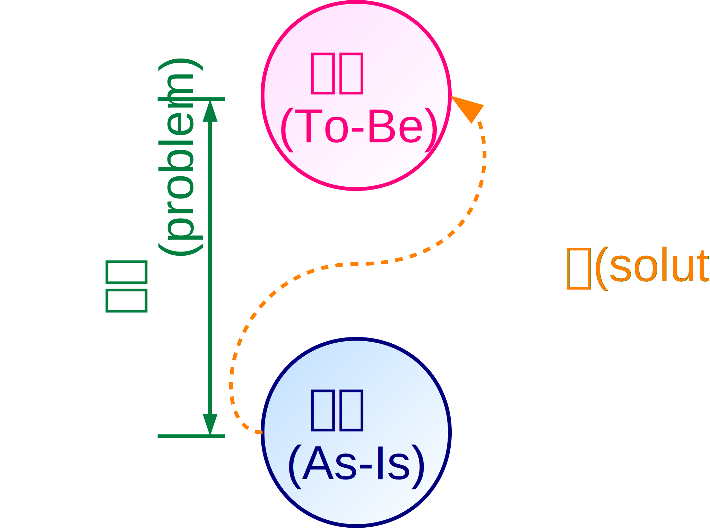
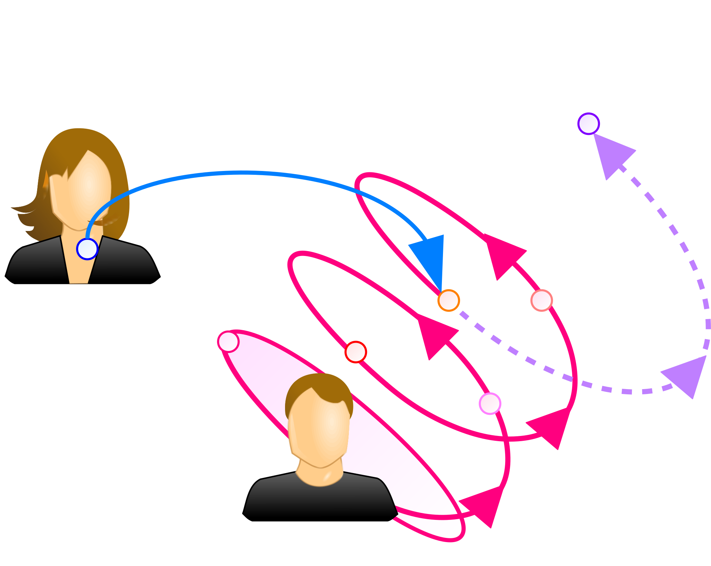
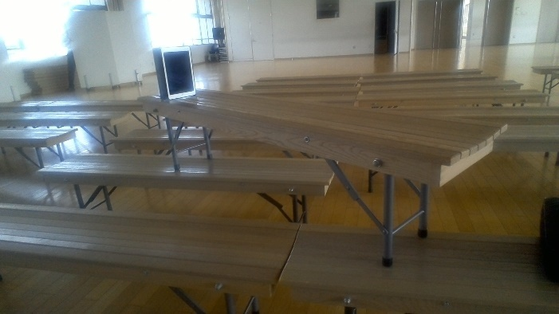
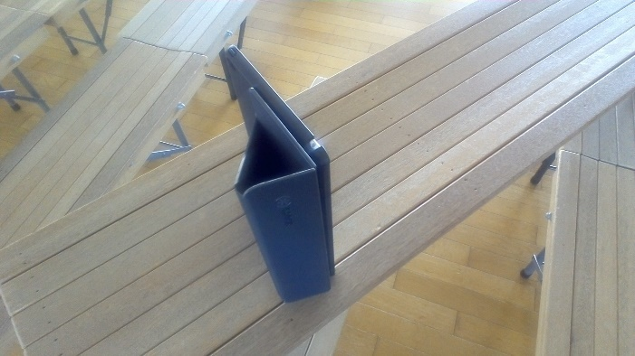

# 介入としての側面に焦点化したプレゼンテーションの教育実践

A Practice of Presentation Education in terms of Interference

次期学習指導要領の「情報I」では、情報社会に主体的に参画する資質・能力を養うことを目標とし、問題の発見と解決に重点をおく。コミュニケーションは問題解決の方法の一つであり、そのうち、最も典型的で多くの教育実践がなされている手段がプレゼンテーションである。だが、現状では理論面の背景が曖昧なまま実習が実施され、目的が不明瞭なまま発表を行うだけで実習が終わることが多い。本稿では、Luhmannによる介入の概念を中核とし、社会システム理論に基づき体系的に展開した教育実践を紹介し、従前の実践と比較する。

キーワード：プレゼンテーション　介入　システム　コミュニケーション　問題解決

はじめに
========

次期学習指導要領[1]の必修科目「情報I」は、「問題の発見・解決に向けて情報と情報技術を適切かつ効果的に活用」し、「情報社会に主体的に参画するための資質・能力」を養うことを目的とする。この目的の下、科目の導入として単元「情報社会の問題解決」を設けて現代社会の**問題**(problem)を俯瞰し、他の各単元で現代社会の問題を解決する方法を学ぶ。特に「コミュニケーションと情報デザイン」は、**コミュニケーション**(communication)を通じて社会の問題を解決する方法を学ぶ単元で、昨今注目されるプログラミングと並び、情報Iで重要な単元とされる。

**プレゼンテーション**(**プレゼン**, presentation)は、**演者**(presenter)から**聴衆**(audience)に対して行う、最も一般的なコミュニケーションによる問題解決の手段である。高校のみならず、義務教育段階でも多くの教育実践がなされている。だが、プレゼンを授業で実施する目的が不明瞭な、次のような実践も見られる。

-   生徒が人前で**話す**経験をさせることに焦点化し、プレゼンが聴衆に与えた**効果の検証や評価が不十分**になっている
-   総合学習などでの課題研究や課題として調べた事柄を**発表**する機会としてプレゼンを位置づけ、**プレゼン自体の学習が不十分**になっている
-   スライド作成の**技術**に焦点化し、スライド以外の演者の言動やプレゼンの内容面の構成を**全体として考えることが不十分**になっている

そこで本稿では、Luhmannの社会システム理論[2]に基づいて体系的に展開したプレゼン実習の授業実践を紹介する。テーマの設定から本番に至るプレゼンの各段階で重要な点を生徒が意識しつつ実践できるよう、文言化した明確な評価基準を提示した。

先行研究
========

問題
----

Simonは、**問題**(problem)を**最初の状態**(As-Is)と**目標の状態**(To-Be)の間の差として定義した[3]。最初の状態から目標の状態へ至る経路を問題の**解**(solution)とし、問題の解を発見することを**問題解決**(problem
solving)と呼んだ。Simonによる問題解決の概念を図1に示す。

社会システム
------------

**システム**(system)はBertalanffy [4]により「相互に作用する要素の集合」と定義された。思考を要素とする**心理システム**や、コミュニケーションを要素とする**社会システム**[2]など、様々な対象がシステムとみなされる。心理システムの代表例が個人であり、社会システムの代表例が組織である。

介入
----

プレゼンを含むコミュニケーションによる問題解決を、Luhmannは**介入**(interference)と総称した[9]。Luhmannは、演者とそれぞれの聴衆という2つの心理システムの間の行為として、介入を「あるシステムがその**行為を通して、他のシステムがどのように行為するか規定**する行為」[9]と定義した。より具体的に述べれば、相手の思考に介入し、**相手に自分の望む行動を起こさせるために行うコミュニケーション**である。

代表的な介入の例に、教育、印象操作、勧誘、檄文、指示、命令がある。Luhmannによる介入の概念図を図2に示す。

提案内容
========

筆者は以前より、勤務校で学校設定科目「情報学基礎」を担当している。「情報学基礎」では「情報I」の実施を見据え、システム概念に基づく教育課程を整備し、体系的な情報教育を実践している[5][6][7]。理論面で学習者を補助する自習用資料[8]や、ルーブリックやワークシートなど実践的な教材を開発している。

年間計画
--------

本年度の「情報学基礎」の年間計画を表1に示す。表1には、各単元のおおよその実施時期を示した他、時間数と、その内数で実習の時間数を概数で示した。本稿に関係の深い単元には、右端に「★」を付した。

表1 「情報学基礎」年間計画(H30年度)

|単元|時間|実習|月||
|---|--:|--:|:-:|---|
|創発|7|x|4|★|
|セキュリティ|3|1|5||
|情報|7|x|5||
|コミュニケーション|4|x|6|★|
|意図|4|2|7-8||
|介入|12|11|9-11|★|
|プログラム|4|1|12||
|表計算|10|10|12-1||
|自由制作|3|3|1-2||
|人間と機械|2|x|2||
|計|56|28|||

教材の作成
----------

実習の実施にあたり次の3種のワークシートを作成し、実習の各段階で生徒に配布した。

-   **目標設定シート**[10]\
    図に示した実習の各段階で留意すべき点を列挙し、4段階で自己評価を行えるワークシートである。現段階でどの程度留意できているかを可視化し、今回の実習でどの項目に取り組みたいか明確にする目的で使用できる。
-   **自己評価シート**[11]\
    図に示した実習の各段階での到達度を、数値ではなく文言で示したルーブリックである。文言の使用により、数値で行うより客観的な評価が可能になり、自己評価や相互評価への生徒の主観による影響を低減する目的で使用できる。
-   **プレゼン分析ワークシート**[12]\
    既存のプレゼン動画を視聴し、時系列の構成や演者の工夫を分析するために用いるワークシートである。個々の生徒が持つプレゼンへの認識を統一し、自身が行うプレゼンを具体的にイメージする目的で使用できる。

授業実践内容
============

授業は勤務校の1年生2クラス(約40名×2)で実施した。実習の事前準備として、2.1節で述べたSimonの問題概念を単元「創発」で、2.2節で述べた社会システム理論を単元「コミュニケーション」で示した。筆者ら[13][14]に、これらの単元の詳細を述べている。

導入
----

授業ではまず、単元「介入」の導入として、2.3節で述べたLuhmannの介入概念を提示した。介入の具体例としてプレゼンを示し、**プレゼンの目的が他者の変容にあることを確認**した。

次に「**目標設定シート**」[10]を用い、これまで生徒が経験してきたプレゼンで、シートの各項目をどの程度意識してきたかを確認させた。その上で、「目標設定シート」の項目のうち、今回の実習で特に取り組みたいものに印をつけさせ、**実習の目標を明確化**させた。

実習概要の説明
--------------

次に、今回の実習の概要を説明した。今回の実習では、一人5分のプレゼンを実施すること、聴衆は同級生数名だが、当日ランダムに抽選して決めること、テーマは各自で自由に設定してよいことを伝えた。実習の実施にあたっては、今回のプレゼンを成功させることよりも、各自が**今後にプレゼンを行う機会を見据えて、プレゼンの方法について実験や工夫を行い、プレゼンそのものを学ぶ機会とすることを重視**させた。

その上で「**プレゼン分析ワークシート**」[12]を配布し、次回までにネット上のプレゼン動画1つを視聴して分析する課題を課した。プレゼンはTED [15]またはTEDの派生イベントであるTEDx [16]で実施されたものとし、生徒が自由に選んでよいとしたが、教員が選んだ動画もいくつか紹介した。この課題を用い、プレゼンを聴衆として見るだけでなく客観的に分析させることで、生徒の中でプレゼンに対する共通認識を定着させ、プレゼン実施時に工夫する点を学ばせる。

テーマの設定
------------

TEDのプレゼンを分析した後、生徒に各自で取り組むプレゼンの**テーマ**を決定させる。「目標設定シート」では「演者自身の**切実な問題意識**」を筆頭の項目に挙げ、テーマ選択の重要性を生徒に伝えた。**聴衆受けの良い安易なテーマ選択を行うのではなく、演者自身の問題意識に基づくテーマ選択を行う**よう指導した。

実習では基本的に個人でプレゼンを実施するため、実習中は個人作業の時間が多い。個人作業だと生徒の進捗状況に差が大きくなるため、どのようなテーマを選んだかを生徒に報告させ、教員側で進捗を把握した。

アウトライン(構成)の作成
------------------------

テーマが決まった後は、生徒にプレゼンの**アウトライン**(構成)を検討させた。アウトラインの概略を記すワークシートを配布し、**スライドを作成する前に構成を検討する段階を明確に設けた**。ワークシートに記入するのは清書ではなく、あくまで構成のラフスケッチである。こうしてアウトラインを検討させることで、成り行きで作成されたスライドを用いた不明瞭な構成のプレゼンが実施される可能性を低減できる。

アウトラインを作成する際は、プレゼンに特徴的な点として**導入**(introduction)を工夫する必要を述べた。**導入段階で聴衆の関心を惹けなければ、介入の成功は難しくなる**ため、導入から**結論**(conclusion)に至る自然な流れを構成することを意識させた。また、介入の相手となる聴衆が人間であることを意識し、**正しい論理を構成するだけでは不十分で、相手が感情で納得できる構成を行う**こと、言い換えれば**相手の感情を考慮に入れた論理を構成**することが重要だと伝えた。

スライド(資料)の作成
--------------------

アウトラインがある程度出来上がった段階で、**スライド**(資料)を作成させた。ソフトウェアの操作についてはPowerPointのマニュアルを配布する程度に留め、必要に応じて生徒から教員に質問させたり、生徒同士で相談させたりした。

スライド作成時には、筆者が作成したスライドで、文章だけでなく**図解**を用いる重要性を説明した。適切な場面で**強調・箇条書き・表・グラフ・図・写真・アニメーション・間・抑揚・強勢・ジェスチャー・実演などを用いて演者の発話を補助することで、効率的で密度の高いプレゼンを実施**することを認識させた。

リハーサル・本番・リフレクション(振り返り)
------------------------------------------

**リハーサル**の実施前には、リハーサルの実施概要を説明した。リハーサルは本番と同じ環境で実施するのが重要なため、本番と同じ場所・時間で実施した。

リハーサルと**本番**では、場所として勤務校内のメモリアルホールを利用した。メモリアルホールには移動可能な椅子が多数並び、十分な広さがある。今回は、その場で生徒約4名からなる11個のグループを作り、互いに隣のグループのプレゼンが邪魔にならないよう、各グループをこのホール内の11箇所に移動させた。移動した場所で、それぞれのグループ内で一人ずつ順に5分間のプレゼンを実施した。その後5分間、リハーサルではプレゼンの内容**検討**の時間を、本番では演者との**質疑**の時間を設けた。

リハーサルと本番の詳細なタイムテーブルを表2に示す。勤務校の授業時間は50分で、「情報学基礎」は週1回、2時間連続で実施している。

表2 リハーサル・本番のタイムテーブル

|時間(分)|リハーサル|本番|
|--:|---|---|
|1時間目|メモリアルホール|
|0|本時の流れを説明|
|5|抽選でグループを決定し移動|
|10|1人目発表|
|15|1人目の検討|1人目の質疑|
|19|2人目準備|
|20|2人目発表|
||(以下同様に4人目まで繰り返す)|
|49|次時の流れを説明|
|50|休憩時間・HR教室へ移動|
|2時間目|ホームルーム(HR)教室|
|60|本時の流れを説明|
|65-100|各自で動画を視聴|
||スライド修正|振り返り|
|100|スライド提出|
|110|次回の説明|

リハーサルと本番では、生徒の振り返りと教員の評価を行うために、**プレゼンの様子を動画で撮影**させた。プレゼンは生徒各自のタブレットPCで実施したが、それ以外にグループに1台ずつ、撮影用のiPadを配布した。iPadは図3、図4に示すように、椅子を重ねた上に縦置きし、演者の全身が写るようにした。

リハーサルと本番の終了後はホームルーム教室へ移動した。撮影した映像や、自己評価シートを使って**リフレクション**(**振り返り**)を行った。生徒には必要ならイヤホンを持参するよう伝え、音声も含め視聴した。

本番の聴衆となる生徒が事前に分かると、プレゼンの構成が特定の生徒に過剰に適応したものになる。これでは一般的なプレゼンから乖離した形式になり、実習として適切なものでなくなる可能性があるため、リハーサルも本番も、直前に抽選でグループを決めた。

実践結果と考察
==============

今回の個人でのプレゼン実習は、従前のグループでの実習と比べ、各自がプレゼンの全ての手順を経験することから、生徒がプレゼン自体に習熟できる機会となったと考えられる。適切なテーマを選択させる方法や教材の内容について、今後の改善が必要である。

参考文献
========

URLは2019/1/20時点のものである。

[1]: http://www.mext.go.jp/component/a_menu/education/micro_detail/__icsFiles/afieldfile/2018/07/11/1384661_6_1_2.pdf "文科省, 高等学校学習指導要領, p.255-263"
[2]: https://amazon.jp/dp/4787714066 "Christian Borch, ニクラス・ルーマン入門――社会システム理論とは何か. 新泉社, 2014, ISBN: 4787714066"
[3]: https://amazon.jp/dp/489362167X "Herbert A. Simon, システムの科学, パーソナルメディア, 1999, ISBN:489362167X"
[4]: https://amazon.jp/dp/4622025221 "Ludwig von Bertalanffy, 一般システム理論――その基礎・発展・応用. みすず書房, 1973, ISBN:4622025221"
[5]: http://www.edu.city.kyoto.jp/hp/saikyo/2017SGH.pdf "藤岡 健史, 中村 央志, 大西 洋, 「情報I」実施を見据えた学際型・教科横断型情報教育の検討と実践―H29年度実施報告, 京都市立西京高校 H29年度SGH研究報告書, p.75-86"
[6]: http://www.zenkojoken.jp/09kanagawa/subcom/ "大西 洋, システム論に基づく情報教育の授業計画と教育実践, 全高情研2016"
[7]: https://www.scribd.com/doc/336892468 "大西 洋, 藤岡 健史, 社会システム理論に基づく情報教育の教材開発, CIS2017"
[8]: https://saireya.gitbooks.io/information-and-system/content/ "大西 洋, 情報学基礎 補助資料"
[9]: http://iss.ndl.go.jp/books/R100000002-I000000035741-00 "Niklas Luhmann, Karl-Eberhard Schorr, Wie ist Erziehung Möglich? - Eine wissenschaftssoziologische Analyse der Erziehungswissenschaft (教育が可能であるとはどういうことか?――教育科学の社会科学的分析(下地ら訳, 東京大学教育学部教育哲学・教育史研究室紀要 vol. 18))"
[10]: https://www.scribd.com/doc/397013909 "大西 洋, プレゼンテーション実習 目標設定シート"
[11]: https://www.scribd.com/doc/397013907 "大西 洋, プレゼンテーション実習 自己評価シート"
[12]: https://www.scribd.com/doc/397013908 "大西 洋, プレゼンテーション実習 プレゼン分析ワークシート"
[13]: https://www.scribd.com/doc/372350824 "大西 洋, 社会のイノベーションを志向する情報教育の体系化, CIS2018"
[14]: https://www.scribd.com/doc/299911454 "大西 洋, 藤岡 健史, コミュニケーション・情報・メディアの統合モデルに基づく教育実践, CIS2016"
[15]: https://www.ted.com "TED, TED: Ideas worth spreading"
[16]: https://www.ted.com/about/programs-initiatives/tedx-program "TED, TEDx Program"
