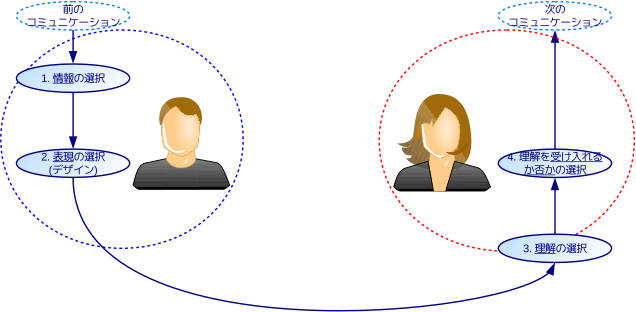

# コミュニケーション・情報・メディアの統合モデルに基づく教育実践
An education practice based on a uniform model of communication, information and media

教育現場でもコミュニケーション能力の重要性が言われて久しいが、コミュニケーションの定義について共通の認識がないまま、生徒に経験を重ねさせ、発見的にコミュニケーション能力を会得させようとする教育実践が多い。本稿では、情報学の知見を用い修正したLuhmannのコミュニケーション・モデルを示し、「社会と情報」の重要概念であるコミュニケーション・情報・メディアへの統一的な視座を与える教育実践を紹介する。

キーワード：コミュニケーション　情報　表現　理解　メディア

はじめに
========

日本経団連の調査[1]で、新卒社員選考にあたり重視した点として「コミュニケーション能力」が11年連続で1位となるなど、コミュニケーション能力は企業で最も重要な能力の1つである。学習指導要領[2]でも、情報科の「社会と情報」が「効果的にコミュニケーションを行う能力」の涵養を目標とする外、外国語科に「コミュニケーション英語I,II」が設けられるなど、コミュニケーションを重視する傾向にある。

しかし、学習指導要領ではコミュニケーションの定義は明記されず、コミュニケーション能力について、外国語科で「情報や考えなどを的確に理解したり適切に伝えたりする」能力と記されるのみである。また、コミュニケーション能力を定義した文科省の審議経過報告[3]によると、「いろいろな価値観や背景をもつ人々による集団において、相互関係を深め、共感しながら、人間関係やチームワークを形成し、正解のない課題や経験したことのない問題について、対話をして情報を共有し、自ら深く考え、相互に考えを伝え、深め合いつつ、合意形成・課題解決する能力」とあり、網羅的だが簡潔でなく、ここからコミュニケーションの本質を掴み、生徒に伝えるのは難しい。

そこで本稿では、社会学者Luhmannのコミュニケーション・モデルを用いた教育実践を紹介する。実践では、「社会と情報」で重要な情報・メディア・コミュニケーションの概念を統一的に理解できるよう、情報学の知見に基づきLuhmannのモデルを修正した。また、生徒調査の結果を紹介して実践の効果を述べ、今後の課題を述べる。

先行研究
========

コミュニケーション
------------------

コミュニケーションの定義は多々あるが、一連の過程としてモデル化して表現されることも多い[4][5][6]。特にShannonによるモデル[7][8]は有名だが、元来計算機向けの通信モデルを人間のコミュニケーションに敷衍するのは過剰であり[9]、妥当なモデルといえない。

本稿では、次の理由から社会学者Luhmannによるモデル[10][11]を用いることとする。

- 言語コミュニケーションだけでなく非言語的なものも含む一般のコミュニケーションを対象としており、適度に単純化されたモデルである。
- Bertalanffy[12]に始まる一般システム理論に裏打ちされたモデルである。同種のモデルにChen[13]があるが、Luhmannのモデルの方が具体的で、高校生に示すのに適している。
- Luhmann自身がモデルをメディアと関連付けているほか、情報概念との親和性も高い。
- 後述の修正を加えることで、「情報は主観的に生成される」という情報の主観性を担保できる。
- モデルの全体理解にはシステム理論の知識が必要だが、概略は高校生でも十分に理解できる。

Luhmannは、コミュニケーションは多者間でなされる4つの選択からなる過程であり、その反復によりコミュニケーションが継続するとした[11]。4つの選択は下記であり、3つの選択と、それに続くメタレベルの選択1つからなる。

- **情報**の選択: 送り手と受け手でやりとりされる情報が選択される。
- **伝達**の選択: 選ばれた情報をどう伝えるかが選択される。
- **理解**の選択: 伝達された事柄をどう理解するかが選択される。
- **理解の受容**の選択: 理解を受け入れるか否か、という理解の受容が選択される。

情報
----

西垣[9]は記号・言語と意味の関係に着目し、情報概念を次の3層に分類した。

- **生命情報**: 「生命の内部(in)に意味を形成(form)させるもの」であり、最広義の情報(information)である。
- **社会情報**: 「記号・言語と意味が一体化した生命情報」であり、その意味を互いに理解することで、生命が社会活動を送ることが可能となる。
- **機械情報**: 「意味が潜在化した社会情報」であり、意味の潜在化により機械的な情報の複製や、計算機による高速な処理が可能となる。

この定義より次の階層関係が成り立ち、生命・社会・機械が扱える情報の広さの差異が示される。

> 生命情報 ⊃ 社会情報 ⊃ 機械情報

メディア
--------

メディアはその語源から、一般に「コミュニケーションにおいて情報を媒介するもの」と定義される。Luhmannはメディアを一般化し、伝播メディアと成果メディアという2種類のメディアが存在するとした[11]。西垣[14]はLuhmannの定義に層別の情報概念を対応付け、次のようにこれらのメディアを再定義した。

- **伝播メディア**: 「機械情報を物理的に媒介するメディア」であり、その存在により遠隔の相手ともコミュニケーションが可能になるメディアである。紙や書籍、動画や放送、電話、インターネット、電子メール、SNSなど、一般に「メディア」と呼ばれるものの大半が該当する。
- **成果メディア**: 「社会情報を論理的に媒介するメディア」であり、その存在によりコミュニケーションが円滑になり、成果が出やすくなるメディアである。真理、愛、貨幣、法、権力、宗教、芸術など社会全体で通用しやすいものの他、特定の国・地域・団体などの組織(システム)でのみ通用する組織文化も該当する。

提案モデル
==========

本実践では、Luhmannのモデルを情報の諸概念と接続するにあたり、次の修正を行った。修正後のモデルを図
1に示す。

- Luhmannはコミュニケーションが再帰的に産出されるとするため「選択」の主体を明示せず、また「送り手」や「受け手」といった非対称性も仮定しないが、ここではより限定的な状況を想定し、前2つの選択は送り手が、後2つの選択は受け手が行うと明示した。
- 「伝達(utterance)の選択」のutteranceは「伝達」と訳される[11]が、「伝えるか伝えないかが選ばれる」ではなく「どう伝達するかが選ばれる」と解するのが妥当である。utteranceの意味[15]を考慮しても、「(発せられた)言葉」の意味で解するべきであり、これを「**表現**の選択」に修正した。上の修正により主体を明示したことで、この選択は**デザイン**に相当し[16]、デザインとコミュニケーションの関係が明瞭化される。

図1では、コミュニケーションの送り手を左側に、受け手を右側に記し、それぞれが選択を行う範囲を点線の円で示している。4つの選択は楕円で表され、選択が行われる順に矢印で結ばれている。

次に、図 1の修正モデルを、西垣[9]の情報概念と次のように接続する。

- 情報の選択における「情報」にはまだ「表現」が与えられていないため、意味のみからなる生命情報に相当する。
- 表現の選択により記号・言語と意味が一体化し、生命情報から社会情報となる。
- 選択された表現は、受け手が理解の選択を行うまでは、記号・言語の意味は潜在化した状態であり、受け手にとっては機械情報である。
- 理解の選択により、機械情報に意味が付与され、受け手にとって機械情報でない社会情報となる。但し、受け手は主観で理解の選択を行うため、送り手の想定通りの理解がされるとは限らない。
- 理解の受容の選択により、受け手に理解が受け入れられれば、社会情報は受け手に取り入れられ、生命情報として受け手に影響を与える。

これに加え、西垣[14]によるメディアの分類を援用した提案モデルを図2に示す。図2では、西垣による情報概念の層を背景に示し、4つの選択は層の境界に位置づけられることが示される。メディアは送り手と受け手の間で両端付きの矢印として示され、情報の各層に対応するメディアの有無が示される。従って図2では、コミュニケーションでの選択と情報・メディアの分類が対応し、これらが有機的に結びつくことが簡明に示される。

なお、生命情報を媒介するメディアにはテレパシーのようなものが想定される。その存在可否はさておき、少なくとも現時点で大多数の人類が使いこなせる状況にないことは確かである。従って、遠回りでも記号・言語による表現、つまり社会情報や機械情報を経由して伝えることが必要である。

授業実践内容
============

前章の提案モデルを基に50分×4時間分の指導案[17][18]を作成し、筆者が勤務する京都市立西京高等学校で授業を実践した。授業は1年生7学級の「社会と情報」の時間で、スライド[19]と板書を中心に行った。実践では、前半2時間はコミュニケーション・モデルを、後半2時間はメディアとその影響を主題とした。なお、この時点で3層の情報概念は既習である[20]。

前半: コミュニケーション・モデル
--------------------------------

前半の授業では、好意を寄せる相手への告白の場面を例として、提案モデルでのそれぞれの選択を順序立てて紹介した。提案モデルは抽象的なモデルなので、これを説明するだけで理解することは難しい。授業で身近な例を示すことで、生徒に実感をもってモデルを理解させることができる。

特に、表現の選択に対する理解を深めるため、産経新聞[21]を基に『「自分の行動を周囲に予測してもらう」ために意識してやっていること』を生徒に問い、全体で共有した。この発問により、日頃のコミュニケーションで生徒が意識していることを共有できる。特に非言語コミュニケーションの表現に着目し、生徒間のコミュニケーションに対する意識の差を顕在化させ、相手を意識する重要性を認識させることができる。

後半: メディアとその影響
------------------------

後半の授業では、前半で説明した4つの選択のみではコミュニケーションが成立しないことを述べ、その間に入るものとしてメディアの概念を導入した。

成果メディアの説明では、災害時に瓦礫の下敷きになった人を助ける場面を例とした。人を助けるという行動は同じでも、コミュニケーションにどの成果メディアが寄与しているかには様々な場合があることを述べた。具体的には、同じ人間としての「愛」に基づいて助ける場合もあれば、放置すれば死んでしまうという「真理」に基づく場合、保護責任者の義務という「法」に基づく場合などがある。

また、より身近な例として、生徒自身が所属する組織を列挙させた。その組織に固有の成果メディアとして、そこでのみ通用する内輪ネタを考えさせた。

アンケート調査結果
------------------

本実践に対する定量的な評価はできていないが、後日に授業評価アンケートを実施した。アンケート自体は情報の授業全般に関するものだが、自由記述欄に回答された、本実践に関する生徒の感想を次に示す。

-   情報にはたくさんの伝え方があり、場合にわけてどのように伝えるのかを考えなくてはいけない。
-   情報の選択や、受け取り方が普段は意識していないけれど大切なんだと感じました。
-   情報の伝え方によって相手が受け止めるものが違うということが分かった。送り手がしっかりとメディアを選択する必要が あると感じた。
-   普段の生活の中で、何気なく行っているコミュニケーションの一つをとっても、本当にたくさんの情報に囲まれているんだなと、驚きました。
-   情報は身近だけれど、とても難しいものだと感じた。同じことを表していても表現の仕方によって伝わり方が全く違ったし、自分も普段の会話やラインで気をつけようと思った。
-   表現の仕方ってとても大事だと改めて思いました。
-   相手にどのように、どうやって情報を伝えると、より理解が深まるかということを考えて情報を発信するということが重要だと思った。
-   伝え方など普段は気にしていなくても改めて言葉でまとめてみると、いろんな方法や媒体を使っているんだと思いました。

実践結果と考察
==============

実践で得られた成果と課題は次の通りである。

-   提案モデルの理解が難しいという意見も若干あったが、生徒の感想は概ね好意的で、普段何気なく行うコミュニケーションを捉え直す視点を生徒に与えることができた。
-   実践の評価が十分でないため、提案モデルに関する理解を評価する課題を設け、生徒の理解度を定量的に評価する必要がある。例えば、円滑でないコミュニケーションの例を探し、その原因を分析し改善案を示す課題などが考えられる。
-   情報科の実習や他の単元との連携が十分でなく、未整理な部分がある。例えば、プレゼンテーションの実習やデザインの授業[16]と一部の内容が重複する。特にメディア・リテラシーは「メディアの『読み書き』能力」[22]で、提案モデルでの送り手と受け手としての能力と捉えると、コミュニケーション能力とメディア・リテラシーの本質は同じである。提案モデルを基に、情報科の内容全体を整理し体系化する必要がある。

参考文献
========

URLは2016/1/12時点のものである。

[1]: https://www.keidanren.or.jp/policy/2014/080.html "日本経団連, 新卒採用(2014年4月入社対象)に関するアンケート調査結果の概要"
[2]: http://www.mext.go.jp/component/a\_menu/education/micro\_detail/\_\_icsFiles/afieldfile/2011/03/30/1304427\_002.pdf "文部科学省, 高等学校学習指導要領, p.87-88, 101"
[3]: http://www.mext.go.jp/b_menu/houdou/23/08/1310607.htm "文部科学省, 子どもたちのコミュニケーション能力を育むために～「話し合う・創る・表現する」ワークショップへの取組～審議経過報告のとりまとめについて"
[4]: http://www4.atpages.jp/sigksn/conf07/SIG-KSN-007-05.pdf "山本 修一郎, 比較コミュニケーションモデル論に向けて"
[5]: http://www.akaokoichi.jp/ARTICLE/modcom1.htm "赤尾 晃一, コミュニケーションの基本的モデル"
[6]: http://www.akaokoichi.jp/ARTICLE/modcom2.htm "赤尾 晃一, コミュニケーションの認知的モデル"
[7]: http://dx.doi.org/10.1002/j.1538-7305.1948.tb01338.x "C. E. Shannon, \"A Mathematical Theory of Communication\", 1948, DOI: 10.1002/j.1538-7305.1948.tb01338.x"
[8]: http://dx.doi.org/10.1002/j.1538-7305.1948.tb00917.x "C. E. Shannon, \"A Mathematical Theory of Communication\", 1948, DOI: 10.1002/j.1538-7305.1948.tb00917.x"
[9]: http://amazon.jp/dp/4757101201 "西垣 通, 基礎情報学――生命から社会へ, NTT出版, 2004, ISBN: 4757101201"
[10]: http://dx.doi.org/10.1111/j.1468-2885.1992.tb00042.x "Niklas Luhmann, \"What is Communication?\", 1992, DOI: 10.1111/j.1468-2885.1992.tb00042.x"
[11]: http://amazon.jp/dp/4787714066 "Christian Borch, ニクラス・ルーマン入門――社会システム理論とは何か. 新泉社, 2014, ISBN: 4787714066"
[12]: http://amazon.jp/dp/4622025221 "Ludwig von Bertalanffy, 一般システム理論――その基礎・発展・応用. みすず書房, 1973, ISBN: 4622025221"
[13]: http://amazon.jp/dp/4130501844 "Dominique Chen, \"基礎情報学の情報システムデザインへの応用に向けた試論\". In: 基礎情報学のヴァイアビリティ: ネオ・サイバネティクスによる開放系と閉鎖系の架橋. 東京大学出版会, 2015, pp. 9–38, ISBN: 4130501844"
[14]: http://amazon.jp/dp/4771109958 "西垣 通, 生命と機械をつなぐ知――基礎情報学入門, 高陵社書店, 2012, ISBN: 4771109958"
[15]: http://eow.alc.co.jp/search?q=utterance "英辞郎 on the WEB, utteranceの意味・用例"
[16]: https://www.scribd.com/doc/255147300 "大西 洋, 藤岡 健史, BADUIからユニバーサルデザインへ展開するデザイン教育実践, CIS2015"
[17]: https://www.scribd.com/doc/274291416 "大西 洋, コミュニケーション指導案"
[18]: https://www.scribd.com/doc/274291417 "大西 洋, メディア指導案"
[19]: http://www.slideshare.net/saireya/ss-51970896 "大西 洋, What is Communication?"
[20]: http://www.zenkojoken.jp/07saitama/subcom "藤岡 健史, 基礎情報学で情報教育を刷新する―SGHアソシエイト校での実践から―, 全高情研2014"
[21]: http://www.sankei.com/west/news/150419/wst1504190003-n1.html "産経新聞, 【車いすでみるなら(4)】奈良公園の鹿が近い…「一人で外出」は歩行者目線を忘れない責任がつきまとう"
[22]: http://amazon.jp/dp/4779304113 "中橋 雄, メディア・リテラシー論, 北樹出版, 2014, ISBN: 4779304113"

