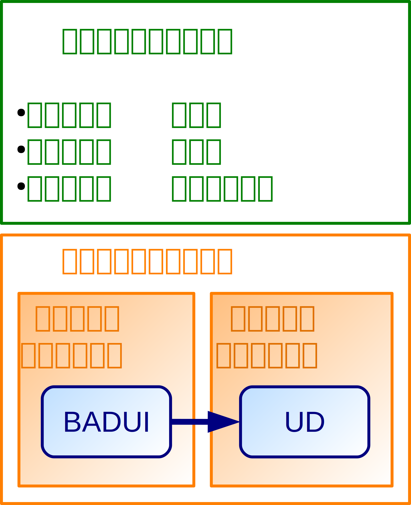
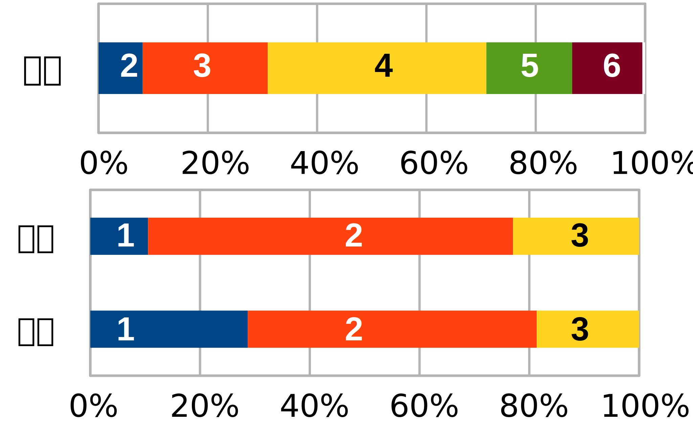
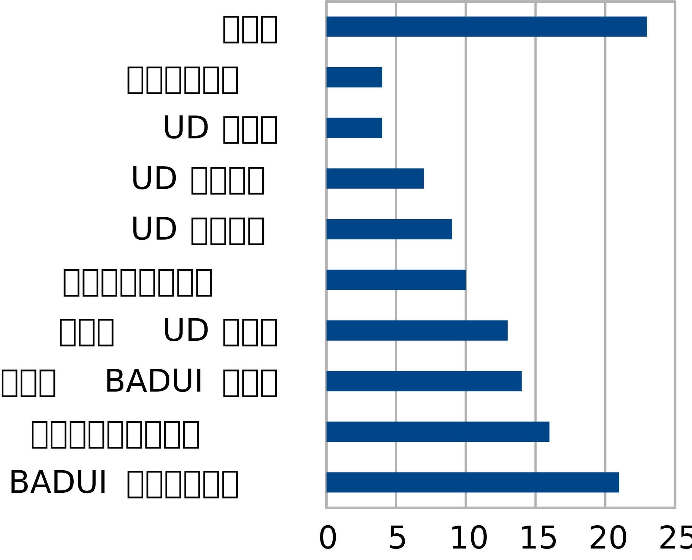

# BADUIからユニバーサルデザインへ展開するデザイン教育実践
A practice of design education expanding from BADUI to Universal Design

デザインはコミュニケーションの根幹に関わる、誰もが日々行う行為だが、共通教科情報の学習指導要領には明示されておらず、各社の教科書も語句とユニバーサルデザイン事例の紹介に留まっている。本稿では、生徒のデザイン能力の涵養を目的に、不便なデザインとユニバーサルデザインを素材とした「社会と情報」でのデザイン教育の実践に加え、既存デザインを改善する課題への生徒の取り組みとその評価結果を紹介する。

キーワード：ユニバーサルデザイン　BADUI　社会と情報　デザイン教育

はじめに
========

「デザイン」について、学習指導要領[1]における専門教科情報の情報デザインでは「適切な情報伝達やコミュニケーションの要件及び手法を取り上げ，情報デザインの目的や役割及び重要性について扱う」(p.261)とあり、デザインと情報伝達やコミュニケーションの密接な関係性を示唆している。情報そのものやコミュニケーションは情報教育の基礎的な概念であり、デザインを学ぶことは、専門学科以外の生徒にも情報を理解する上で意義深いといえる。

だが、共通教科情報では社会と情報で「人間にとって利用しやすい情報システムの在り方(中略)について考えさせる」(p.102)、情報の科学で「情報機器や情報通信ネットワークの様々な機能を簡単に操作できるようにする工夫及び高齢者や障害者による利用を容易にする工夫などについても扱う」(p.103)と記述があるのみである。また社会と情報の各社の教科書も、ユーザインタフェースやユニバーサルデザイン(UD)などの語句とUDの事例紹介に留まり、デザインの本質を理解したりデザイン能力を学べるものにはなっていない。

そこで本稿では、共通教科情報で高校生全員が学ぶべき「デザイン」とは何か考察した上で、高校での筆者の授業実践を紹介する。生徒に課した課題の評価を通じて実践を評価し、今後の課題を述べる。本稿で述べる授業実践の全体的な枠組みを図1に示す。

授業設計: 高校生が学ぶべき「デザイン」とは
==========================================

デザインの定義は多々提案されているが、Ralphは「a specification of an object, manifested by an agent, intended to accomplish goals, in a particular environment, using a set of primitive components, satisfying a set of requirements, subject to constraints」[2]、即ち「与えられた環境で目的を達成するために、様々な制約下で、利用可能な要素を組み合わせて、要求を満足する対象物の仕様を生み出すこと」[3]と定義している。この定義は汎用的だが、生徒には抽象的すぎて伝わりにくく、またこの定義を覚えても、実践的なデザインができるようにならない。

本稿では、実践の目的、つまり高校生が共通教科情報の授業で理解すべきデザインの基礎事項として次の2点を挙げ、それを5つの事項に細別する。

1. **デザインの基本的理解**
    1.  デザインは日常生活の中で誰もが行う、身近なことである点(*普遍性*)
    2.  デザインは論理的に決定されるもので、才能や感覚に依拠しない点(*論理性*)
    3.  デザイン能力の向上には、人間について学ぶことが必要だという点(*人間中心主義*)
2. **デザイン・リテラシー**
    4.  デザインを批判的に見る(*「読む」*)能力
    5.  デザインを作る(*「書く」*)能力

本章では以下、デザインの基本的理解に関する項目を詳述する。なお本稿では「デザイン・リテラシー」について、細別した2つの能力の総称と定義する。これらの涵養のための実践は次章で詳述する。

デザインの普遍性
----------------

「デザイン」と聞いて多くの生徒はイラストやものづくりを想起する。その想起からは「デザイン」はデザイナー・アーティストなど特殊な職業の人間だけが行うもの、または美術の時間・プレゼンテーションなど特殊な機会でのみ行うものだという認識が伺える。

しかし、Ralph[2]にあるように、デザインは非常に広範な場面で行われる。人間誰もが行う、他者とのコミュニケーションのために言葉や身振りなどの表現を選ぶことや、自己実現のため日々の計画を立てることは、他でもないデザインである。そこでまず、誰もが日常で無意識に行う種々の行為がデザインで、誰にでも関係がある普遍的なものだと認識させる必要がある。

デザインの論理性
----------------

「デザイン」はよく、才能や感覚(センス)に依拠しており、特殊な能力がなければできないと誤解されている。デザインとアートを混同したこの認識は、特に今までデザインをあまり意識してこなかった生徒が、デザインを縁遠いものに感じる原因になる。

Ralph[2]の定義では、デザインは無限の組み合わせから選ぶものでなく、所与の「環境・制約・要素」の有限の組合せから選ぶものである。これは一種の最適化問題で、考えうるデザインの組合せすべてを試せば、誰もがいつか最適なデザインに辿り着くのである。

もちろん総当たりで試す時間はないので、効率的に最適なデザインを探す方法が必要である。その指針としてRalphは、「目的を達成」すること、「要求を満足」することを挙げており、これらに関する理論を学べば、才能やセンスのない人間でもデザイン・リテラシーが向上することを示している。

人間中心主義のデザイン
----------------------

Ralphのいう「目的を達成」するために何を学べば良いのかを考える際には、「相手」の存在が重要である。すべてのデザインには、「相手」が存在する。「相手」とは対象となる人間のことで、モノなら利用者、メッセージなら受信者、発表なら聴衆であり、デザインした人自身も含みうる。

つまり、「目的を達成」できない悪いデザインとは、「相手」に伝わらないデザインである。従って、「相手」を学ぶことがまず必要である。他の生徒に発表するならその生徒を知らねばならないし、利用者の使い方を想定しなければ使いやすいものは作れない。より一般に、人間である「相手」の理解には、人間の心理、認知、記憶、学習、行動に関する理論を学ぶことが必要である。「人間」について学べばデザインの原理が理解でき、デザイン・リテラシーが向上するというのが、この実践で最も生徒に伝えたいことである。

授業実践内容
============

前章の設計を基に指導案[9]を作成し、筆者が勤務する京都市立西京高等学校で授業を実践した。授業は1年生7学級の「社会と情報」の時間で、スライド[10]と板書を中心に行った。実践では、2時間連続(50分×2)の時間のうち前半40分をデザインの基本的理解に、後半60分をデザイン・リテラシーに充てた。授業後、2週間程度の期間を設けて課題[11]を出した。後日、課題を返却する際は、他の生徒が提出した課題を紹介しながら、補足説明やフィードバックを行った。

デザインの基本的理解
--------------------

まず動機付けとして、デザインの普遍性について述べた。デザインの例として建築や都市計画だけでなくSNSのメッセージなども最初に提示し、イラストやものづくりに興味のない生徒にも、デザインを学ぶ価値のあるものだと認識させた。

次にデザインの論理性を伝えるべく、デザインとアートの違いを述べたblog記事[4][5]と、アメリカの建築家Sullivanによる「**形態は機能に従う(Form Follows Function)**」[6]という理念を紹介した。

前者は、デザインには「相手」がいて、相手に「伝える」のが目的(表現はその手段)で、相手に「理解」されることが必要、デザインには「制限」があることから、デザインを「客観的な美」とまとめている。一方アートは、相手はいなくともよく、「表現する」のが目的で、誰にも理解されずとも良く、制限なく行えることから、「主観的な美」とまとめている。

後者は「ものの機能(function)が定まれば、ものの形態(form $\cong$ デザイン)は決定される」の意で、機能美の理念として有名である。これは、デザインは感覚で選ぶのではなく、機能が決まれば論理的に必然的に決まることを示している。なおこの「機能」は「モノのidentity」に近い広義の言葉で、椎橋ら[7][8]が詳しい。

その上で、先述のようにデザインは人間中心主義であることを理解させた。

デザイン・リテラシー
--------------------

「不便なデザイン」や「問題のあるデザイン」を、中村[12][13]は **BADUI(Bad User Interface)** と呼んでいる。授業の後半では、デザイン・リテラシーを向上させる基礎として、BADUIを良いデザイン(UD)に改善する事例を紹介した。同時に、人間のもつ多様な特性の幾つかを、次の流れに沿って取り上げた。

1. 人々のもつ特性を紹介する(例: 色覚異常)。
2. その人々にとって不便なデザインを示す。
(例: 系列を判別しにくい色で区別しているため、系列を見分けられない折れ線グラフ)
3. なぜそれが不便なのかを伝える。
(例: 色で対応付けを表現しているから)
4. その人々にとって便利なデザインを示す。
(例: 線種や線の太さでも対応付けを行う)
5. そのデザインが、特性をもたない他の人々も便利な(よりuniversalな)ことを伝える。
(例: カラー資料を白黒コピーしても区別可能)

実際に扱った題材は「学習障害(LD)」「色覚異常」「自閉スペクトラム障害(ASD)」であり、これらからそれぞれ「affordance」「対応付け」「制約・一貫性」のデザイン原理に対応させて紹介した。

生徒課題の内容
--------------

2時間の授業後に、より身近な生活の中でデザイン・リテラシーを涵養すべく、生徒に次の課題を課した。なお一部のクラスでは、中村[12]を参考に取り組んでも良いと指示した。

1. 身の回りにあるBADUIを見つける。
2. そのデザインで誰が困るのか、どんな問題が起こるのかを記す。
3. なぜそれが不便なのかを記す。
4. デザインの改善案を記す。
5. 感想(任意)。

この課題の(1),(2),(3)はデザイン・リテラシーの「読む」能力に対応する。「読む」能力の涵養には、日頃から身近なデザインを観察することが重要なので、提出締切を2週間後とした。生徒にも、前日に急に探しても見つからないので、日頃からBADUIを探すよう伝えておく。また(4)は「書く」能力に対応する。「書く」能力については、Ralphが「様々な制約下で」と条件をつけているように、完璧でなくても良いが、コストのかからない、少しの工夫でできる現実的な改善案が望ましい。例えば「階段にエレベータを設置する」は改善案だが、莫大な費用を要し現実的でない。

生徒課題の評価
--------------

提出された課題は、選んだBADUIの良さを「*題材点*」、問題分析と改善案を「*内容点*」として算出し、その合計点で評価した。「題材点」は主に「読む」能力を、「内容点」は主に「書く」能力を評価している。個々の得点基準を表1に示す。

<!-- 表1: 課題の評価基準 -->

|  点|  題材点                                            |内容点
|----|--------------------------------------------------|------------------------------------
|  0 |  未提出                                           | 未提出
|  1 |  趣旨に即さないもの、改善案が安易に思い浮かぶもの | 安易な分析・改善案しかないもの\*
|  2 |  趣旨を踏まえたもの\*\*                           | 趣旨を踏まえたもの
|  3 |  より着眼の鋭いもの                               | 工夫ある改善案や深い洞察のあるもの

\*: 「手すりがない」に「手すりをつける」など

\*\*: エレベータの開閉ボタンなど定番のものを含む

課題提出率は75%であった。提出分のうち、題材点と内容点の分布を図2、合計点の分布を図3に示す。

下記に、満点とした課題例を要約して紹介する。

1. ルーズリーフのバインダー。
2. バインダーのリングを開ける部分に左向きの矢印が表記されているが、実際は右斜め下向きにスライドしないとリングが開かない。
3. 矢印の向きと開け方が合っていないから。
4. 右斜め下向きの矢印に変更する。もしくは、代表的なバインダーでは下向きにスライドすればリングが開くので、その開け方と同様にする。

感想は任意としたが、大まかに分類すると図4のようになった。題材のBADUIが見つからないというだけでなく、現代社会の便利さ・UDの普及を実感したという感想もあった。逆に、BADUIが身近に多々あること、BADUIができないよう多様な視点でデザインすることの重要さを指摘した感想もあった。また、デザインに対する論理性、利用者を考慮することの重要性に対しても言及があった。また、授業ではほぼ割愛したUDの限界についても指摘があった。

実践結果と考察
==============

実践で得られた成果と課題は次の通りである。

-   筆者の想定より多様なBADUIを挙げる生徒や、非常に熱心に分析・改善案を考察した生徒が多く、学びの多い課題になったことが伺える。
-   反面、有名なバリアフリー事例や、ネットで知られた例を挙げる生徒もおり、見つけた事例で最も興味深いものを題材に選ばせるなど、題材を注意深く探させる指示が必要である。
-   授業前半で敢えてデザインの定義を明示しなかったが、数名の生徒から「デザインとは何か答えられない」「どこまでがデザインの範疇か分からない」との感想があった。Ralphの定義は若干難しいが、何らかの形で提示しても良い。
-   授業後半で取り上げたデザイン原理を生徒に重視させすぎた。筆者としては、これらはあくまで一例であったが、課題に取り組む際に生徒にこのどれかに無理に当てはめさせてしまった。本質は原理の暗記でなくデザイン・リテラシーの涵養だと強調すべきである。
-   課題返却の際、他の生徒の題材を紹介して生徒と楽しむだけになり、体系的に整理できなかった。題材をUD7原則などで分類すれば、より学びの多いフィードバックになると考えられる。
-   UDが完璧なものでないこと、本当にuniversalなデザインが存在しうるかといった点について、授業ではほぼ割愛した。感想欄でその点を指摘した生徒もいたが、この話題を議論するには、土台としてUDの知識が必要であり、2時間+αの授業時間では困難だった。しかし、UDの不完全性を前提としてどうデザインするかを協働学習すれば、より深い学びに繋がると考えられる。

参考文献
========

明記のないURLは2015/2/5時点のものである。

[1]: http://www.mext.go.jp/component/a_menu/education/micro_detail/__icsFiles/afieldfile/2011/03/30/1304427_002.pdf "文部科学省, 高等学校学習指導要領, p.101-104, 260-261"
[2]: http://hdl.handle.net/2429/29536 "David Paul Ralph, \"Fundamentals of software design science\", 2010"
[3]: http://www.design.kyoto-u.ac.jp/smalltalk/smalltalk_01 "京都大学 デザイン学大学院連携プログラム, 「デザイン」の定義"
[4]: http://www.admixweb.com/2009/11/11/design-and-art-are-they-the-same "Admix Web, 「Design and Art: Are They the Same?」, 2009. (2015/2/5時点でリンク切れ)"
[5]: http://www.webcreatorbox.com/webinfo/art-design "Webクリエイターボックス,「アートとデザインの違いは?」, 2010"
[6]: http://amazon.jp/dp/430604582X "Louis H. Sullivan,『サリヴァン自伝』, 竹内 大, 藤田 延幸訳, 鹿島出版会, 1977, p.269, ISBN: 978-4306045828"
[7]: http://ci.nii.ac.jp/naid/110006643295 "椎橋 武史, 小林 克弘, 木下 央, ルイス・サリヴァンの「形態は機能に従う(Form Follows Function)」に関する考察, 日本建築学会学術講演梗概集F-2, 2007, pp.545-546"
[8]: http://ci.nii.ac.jp/naid/110007072574 "椎橋 武史, 小林 克弘, 木下 央, ルイス・サリヴァン批評の時代的変遷に関する考察, 日本建築学会学術講演梗概集F-2, 2005, pp.577-578"
[9]: https://scribd.com/doc/254365438 "大西 洋,「ユニバーサルデザイン指導案」"
[10]: http://www.slideshare.net/saireya/what-is-design-44244816 "大西 洋, 「What is design?」"
[11]: https://scribd.com/doc/254364967 "大西 洋,「ユニバーサルデザイン課題」"
[12]: http://badui.org "中村 聡史,「楽しいBADUIの世界」"
[13]: http://amazon.jp/dp/477417064X "中村 聡史,『失敗から学ぶユーザインタフェース 世界はBADUI(バッド・ユーアイ)であふれている』, 技術評論社, 2015, ISBN: 978-4774170640"
